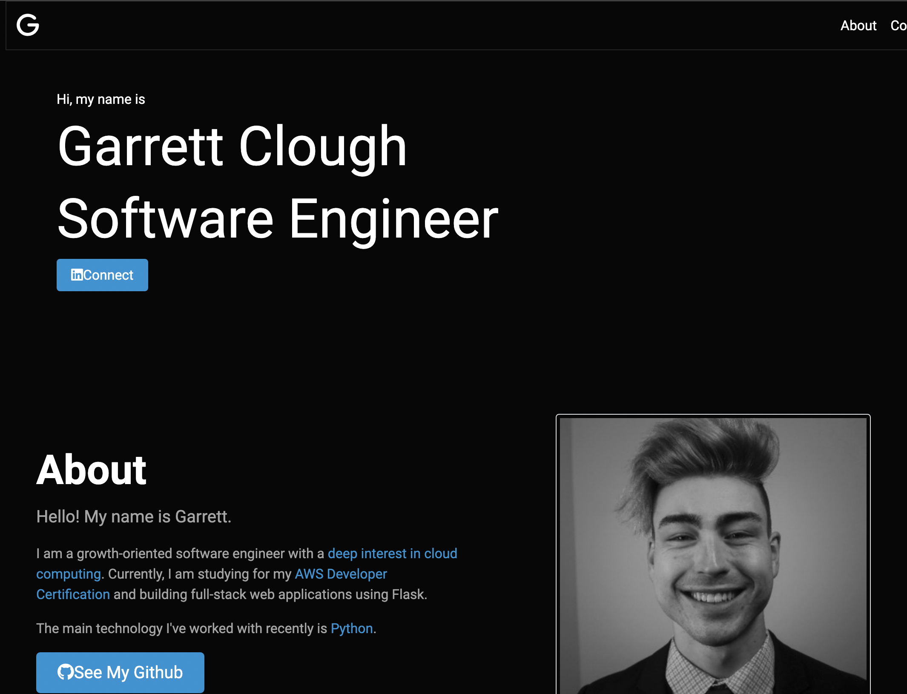

# garrettt.com v1
 First iteration of my personal website built with Bootstrap5. Features light/dark mode and NASA API integration.

 

# Gratitude

(Vino Rodriguez)[https://github.com/vinorodrigues] wrote an excellent article on implementing the multiple stylesheets (e.g. dark/light mode)

(Brittany Chiang)[https://brittanychiang.com/] offered excellent advice for what a portfolio website should contain.

(Komini)[https://komini.se/] is an agency which has an inspiring website design.